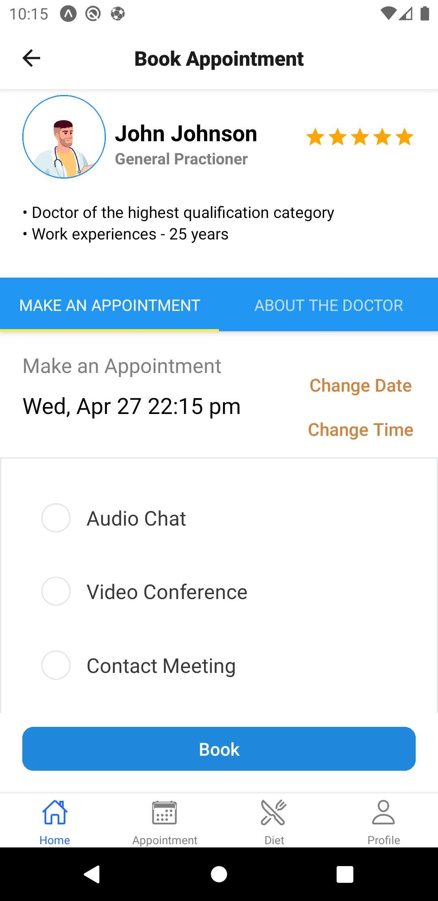

# Doctor App - React Native

Mobile application project created with Expo, React Native, Firebase and some wonderful libraries for React Native application.

## Table of Contents

- [General Info](#general-info)
- [Main Features](#main-features)
- [Technologies](#technologies)
- [Quick Start](#quick-start)

## General Info

This Doctor Mobile application allows customers to create their account for health checking and book an appointment with their desired doctors.

### Home Screen

<p flexDirection="row">


</p>

### Booking Screen

<p flexDirection="row">


</p>

## Main Features

- Complex navigation (Tab, Stack, TabView)
- Connect to Firebase (Authentication)
- Sign up credentials and login, sign out
- Get current date and date format
- Search doctor, filter by First Name and Last Name
- Book an appointment with the doctor by choosing time and select one meeting option. There are 3 options for meeting with the doctor: Audio Chat, Video Conference, Contact Meeting.
- Check the booking in the Appointment Screen

## Technologies

- Expo
- React Native
- React Native Elements
- React Native Vector Icons
- React Navigation V6
- React Native Community - datetimepicker V4
- Date-fns format
- Radio Button React Native V1
- Firebase Authentication V8
- Firebase Realtime Database

## Quick Start

Here are some steps to run this project:

1. Clone the project

```
git@github.com:AnhCaooo/App-Doctor.git
```

2. Download node_modules

```
npm install
```

3. Run Expo

```
expo start
```
